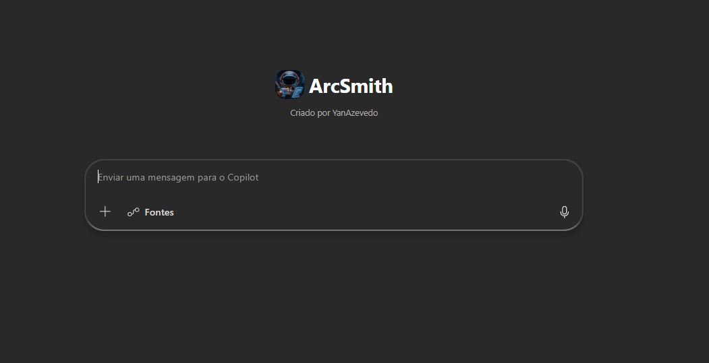

<h1 align="center">⚒️ ArcSmith</h1>

<p align="center">
  
</p>

<p align="center">
  <strong>Forge the arc. Smith the prompt.</strong><br>
  Declarative Agent para Microsoft 365 Copilot — especializado no desenvolvimento estruturado de soluções de IA.
</p>

<p align="center">
  
  
  
  
  
  
</p>

---

## Sobre o projeto

O **ArcSmith** é um agente declarativo construído sobre o Microsoft 365 Copilot que consolida em um único fluxo a metodologia completa de **desenvolvimento de soluções de IA** — desde a captura da necessidade até a entrega da solução final estruturada.

Foi concebido como ferramenta operacional para acelerar e qualificar a construção de prompts e agentes, aplicando engenharia de prompt rigorosa e metodologia autoral fundamentada em prática profissional contínua.

> *"Forje o arco da narrativa. Construa o prompt com precisão."*

---

## Origem do projeto

O ArcSmith nasceu da consolidação de dois agentes autorais anteriores em um único fluxo coeso:

| Agente original | Função | Status no ArcSmith |
|---|---|---|
| **Casetron** | Transformar entrevistas em cases de valor | ✅ Integrado |
| **Prompt Smith** | Engenharia e refinamento de soluções | ✅ Integrado |

A consolidação eliminou a fragmentação entre identificação de oportunidades e construção técnica, permitindo que ambas as etapas operem dentro de um mesmo agente com contexto compartilhado e arquitetura unificada.

<p align="center">
  
</p>

---

## Arquitetura técnica

O ArcSmith não utiliza RAG técnico tradicional — opera com **arquitetura híbrida de grounding multi-fonte com retrieval aumentado**, combinando conhecimento curado autoral, retrieval dinâmico externo e grounding nativo no tenant.

```
┌──────────────────────────────────────────────────────────────┐
│                      ARCSMITH                                │
│           Declarative Agent — Schema v1.7                    │
│                                                              │
│  ┌────────────────────────────────────────────────────────┐  │
│  │  REGRA FUNDAMENTAL                                     │  │
│  │  Foco absoluto na entrega de valor ao usuário final    │  │
│  └────────────────────────────────────────────────────────┘  │
└──────────────────────────────────────────────────────────────┘
                            │
        ┌───────────────────┼───────────────────┐
        │                   │                   │
        ▼                   ▼                   ▼
┌───────────────┐  ┌────────────────┐  ┌────────────────┐
│  MÓDULO ARC   │  │ MÓDULO SMITH   │  │ CODE INTERPRETER│
│               │  │                │  │                │
│  Documenta    │  │  Engenharia    │  │  Análise Python │
│  cases a      │  │  de prompts    │  │  e geração de   │
│  partir de    │  │  e agentes IA  │  │  artefatos      │
│  transcrições │  │                │  │                │
└───────────────┘  └────────────────┘  └────────────────┘

CONHECIMENTO ESTRUTURADO (Grounding sofisticado)
┌────────────────────────────────────────────────────────────┐
│                                                            │
│  📘 ForgeProtocol         📗 SolutionKnowledge             │
│  Engenharia de prompt     Metodologia autoral de           │
│  (GitHub Pages)           construção de soluções           │
│                           (GitHub Pages)                   │
│                                                            │
│  🌐 Microsoft Learn MCP   🏢 Tenant M365 Native            │
│  Documentação técnica     OneDrive, SharePoint,            │
│  oficial em tempo real    Teams, Email                     │
│                                                            │
└────────────────────────────────────────────────────────────┘
```

---

## Capacidades

### 🎯 Módulo Arc — Documentação de Cases

Interpreta transcrições, anotações e resumos de conversas com stakeholders e estrutura cases padronizados de oportunidades de IA.

- Identificação automática de múltiplos cases em uma única transcrição
- Reconstrução do processo atual (AS-IS) com gargalos destacados
- Desenho do processo futuro (TO-BE) com papel da IA vs humano
- Classificação de complexidade: 🟢 Baixa / 🟡 Média / 🔴 Alta / 💼 Projeto
- Quadrante de priorização por Impacto vs. Esforço

### ⚒️ Módulo Smith — Engenharia de Prompt

Constrói instruções estruturadas para o correto funcionamento de soluções em IA, aplicando arquitetura e engenharia de prompt adequadas.

- Geração de Prompt-Base estruturado em JSON
- Edição incremental sem perda de coerência
- Parâmetros de refinamento: Temperature, Goal, Tone, Format, Use Case, Context, Instructions, Output
- Comando de reset para iniciar novos prompts do zero

### 🧪 Módulo Code Interpreter — Análise e Visualização

Executa Python em sandbox para apoiar análise de dados, validação de JSONs e geração de artefatos para entrega.

- Validação e formatação de Prompt-Base JSON
- Análise de planilhas de levantamento (CSV/TSV)
- Geração de gráficos de complexidade e priorização
- Criação de arquivos para entrega ao usuário final

### 🌐 Microsoft Learn MCP (Model Context Protocol)

Conexão dinâmica com a documentação oficial Microsoft em tempo real, garantindo que o agente nunca prometa funcionalidades inexistentes do Copilot.

- `microsoft_docs_search` — busca semântica na documentação oficial
- `microsoft_docs_fetch` — recuperação de páginas completas em markdown

### 🏢 Grounding nativo no Tenant M365

Acesso direto ao contexto do usuário via capabilities nativas do Declarative Agent.

- **OneDriveAndSharePoint** — documentos, OneNote, arquivos
- **TeamsMessages** — conversas, canais, chats
- **Email** — histórico de e-mails do usuário

---

## Metodologia autoral

O ArcSmith opera sobre uma metodologia própria de construção de soluções de IA para Microsoft Copilot, fundamentada em prática profissional contínua em múltiplos contextos e alinhada a princípios reconhecidos internacionalmente.

### Princípios fundamentais

- **Valor de negócio em primeiro lugar** — soluções devem gerar benefício tangível
- **IA como extensão cognitiva, não substituição** — ampliar capacidades humanas
- **Consultoria antes de tecnologia** — entender o problema antes de propor ferramenta
- **Iteração orientada a feedback** — desenvolvimento incremental com usuários
- **Simplicidade e clareza** — menos é mais
- **Ética e privacidade por padrão** — uso responsável de dados
- **Foco no usuário final** — adoção real define sucesso
- **Mensurabilidade do valor** — métricas comprovam impacto

### Bases de conhecimento

| Documento | Foco | Status |
|---|---|---|
| **ForgeProtocol** | Engenharia de prompt — estrutura JSON, parâmetros e boas práticas | ✅ Ativo |
| **SolutionKnowledge** | Metodologia completa de construção de soluções de IA | ✅ Ativo |

Acesse a base completa em [yan-azevedo.github.io/Arc.Smith](https://yan-azevedo.github.io/Arc.Smith/).

---

## Stack técnica

| Camada | Tecnologia |
|---|---|
| **Plataforma** | Microsoft 365 Copilot |
| **Framework** | Microsoft 365 Agents Toolkit |
| **Schema** | Declarative Agent v1.7 |
| **Modo de resposta** | Think deeper (raciocínio profundo) |
| **Knowledge sources** | GitHub Pages (WebSearch) |
| **Retrieval externo** | Microsoft Learn MCP (HTTP) |
| **Grounding tenant** | OneDrive, SharePoint, Teams, Email |
| **Análise de dados** | Code Interpreter (Python sandbox) |
| **Versionamento** | Git + GitHub |
| **Idioma operacional** | pt-BR |

---

## Comportamento avançado

O ArcSmith opera com configurações de comportamento herdadas do schema v1.7 que elevam significativamente a qualidade das respostas:

```json
"behavior_overrides": {
  "default_response_mode": "Think deeper",
  "special_instructions": {
    "discourage_model_knowledge": true
  }
}
```

- **Think deeper** — modo de raciocínio profundo ativado por padrão, alinhado com Chain of Thought e Extreme Ownership
- **Discourage model knowledge** — prioriza o conhecimento curado (ForgeProtocol + SolutionKnowledge + MCP) sobre o conhecimento genérico do modelo

---

## Estrutura do repositório

```
Arc.Smith/
├── .vscode/
├── appPackage/
│   ├── ai-plugin.json          # Plugin MCP (Microsoft Learn)
│   ├── declarativeAgent.json   # Definição principal do agente
│   ├── instruction.txt         # Instruções operacionais (≤8000 caracteres)
│   ├── manifest.json           # Manifesto do app M365
│   ├── color.png               # Ícone principal (192x192)
│   └── outline.png             # Ícone de contorno (32x32)
├── docs/
│   ├── ForgeProtocol.md        # Base de conhecimento — engenharia de prompt
│   ├── SolutionKnowledge.md    # Base de conhecimento — metodologia
│   └── Assets/                 # Imagens e logos
├── env/
├── .vscode/mcp.json            # Configuração do MCP server
├── m365agents.yml              # Configuração do Agents Toolkit
├── README.md                   # Este documento
└── LICENSE.md
```

---

## Pré-requisitos

- **Node.js** 18, 20 ou 22
- **Microsoft 365 Agents Toolkit** (VS Code extension 5.0.0+)
- **Licença Microsoft 365 Copilot**
- **Conta Microsoft 365** para desenvolvimento

---

## Como executar

```bash
# 1. Clone o repositório
git clone https://github.com/Yan-Azevedo/Arc.Smith.git

# 2. Abra no VS Code
code Arc.Smith

# 3. Faça login no painel do M365 Agents Toolkit

# 4. Incremente a versão no manifest.json (se houver mudanças)

# 5. Execute o Provision pelo painel Lifecycle do Toolkit
```

Após o Provision, o ArcSmith estará disponível em [m365.cloud.microsoft](https://m365.cloud.microsoft) na lista de agentes.

---

## Status do projeto

| Componente | Status |
|---|---|
| Módulo Arc (Cases) | ✅ Operacional |
| Módulo Smith (Prompts) | ✅ Operacional |
| Módulo Code Interpreter | ✅ Ativo |
| Microsoft Learn MCP | ✅ Integrado |
| ForgeProtocol Knowledge | ✅ Publicado |
| SolutionKnowledge Knowledge | ✅ Publicado |
| Grounding M365 (Teams, OneDrive, Email) | ✅ Habilitado |
| Templates de entrega | 🔨 Em desenvolvimento |

---

## Evolução futura

- Templates institucionais de cases para aprovação do usuário final
- Templates de entrega final (manual do usuário + documentação técnica)
- Migração para Embedded Knowledge quando Microsoft suportar `.md`
- Arquitetura RAG técnica (vector store + embeddings) quando base de cases ultrapassar volume justificável

---

## Licença

Este projeto está licenciado sob **Creative Commons Atribuição-NãoComercial-SemDerivações 4.0 Internacional (CC BY-NC-ND 4.0)**.

Consulte [LICENSE.md](LICENSE.md) para os termos completos.

---

## Autor

**Yan Azevedo**

Projeto autoral fundamentado em metodologia própria construída a partir de prática profissional contínua. O ArcSmith é uma ferramenta operacional para acelerar e qualificar o desenvolvimento de soluções de IA com Microsoft Copilot.

---

<p align="center">
  <em>"Forje o arco da narrativa. Construa o prompt com precisão."</em>
</p>